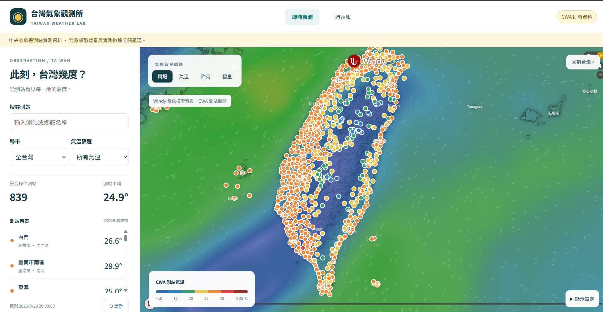

# HW1: CWA 天氣預報網站 using AI Agent

> **課程名稱**：AIoT 與數據分析（AIoT & Data Analytics, AIoT-DA）  
> **作業主題**：HW1 — CWA 天氣預報網站 using AI Agent  
> **作者**：Aiden Xiao  
> **儲存庫網址**：https://github.com/AidenXiao0924/HW-1-CWA-Weather-Forecast-Website  
> **Live Demo Page**：https://taiwan-weather-eight.vercel.app/

## 網站畫面




單一天氣地圖網站，整合即時測站觀測與一週預報。

## 開啟網站

此電腦已安裝執行環境，雙擊 `start.bat`，開啟 http://127.0.0.1:8000 。啟動程式只啟動這一個網站。

新電腦首次使用請先執行 `setup.bat`（Python 3.11 以上），再執行 `start.bat`。停止服務使用 `stop.bat`；修改 `.env` 後需重新啟動。

## 功能

- 即時觀測：CWA 氣溫圓點、測站明細、搜尋、縣市與溫度篩選。
- Windy 背景：依金鑰方案切換風場與氣溫等圖層。未設定時使用 OpenStreetMap。
- 一週預報：六區選單、每日最高最低溫圖表、表格及 CSV 匯出。
- 後端每 10 分鐘更新，前端每 5 分鐘更新；失敗時保留 SQLite 快取。
- CWA 實測資料與 Windy 模型背景分開顯示。

## 設定

保留自己的 `.env`，不要將金鑰提交至版本控制。新安裝可複製 `.env.example`：

```env
DATA_MODE=live
CWA_API_KEY=你的氣象署金鑰
WINDY_API_KEY=你的WindyMapForecast金鑰
CWA_FORECAST_DATASET=F-D0047-091
CWA_OBSERVATION_DATASET=O-A0001-001
CACHE_TTL_SECONDS=600
```

CWA 金鑰僅在後端使用；Windy 是瀏覽器端金鑰。Testing 方案的可用氣象圖層有限。

設定 `DATA_MODE=demo` 可使用明確標示的固定模擬資料，使用獨立 demo.db；正式資料使用 data.db。live 失敗不會改用示範資料。

## 技術與套件

後端：Python、FastAPI、Uvicorn、Requests、python-dotenv，以及內建 sqlite3。
前端：HTML、CSS、原生 JavaScript、Leaflet、Windy Map Forecast API。
測試：pytest、HTTPX。網站不再依賴 Streamlit、Pandas、Altair 或 Folium。

## 資料處理與 API

`fetch_weather.py` 取得 JSON；`parse_weather.py` 驗證及彙整；`database.py` 保存 SQLite；`service.py` 管理快取；`backend.py` 提供 API 與 frontend/ 靜態網頁。

需要展示資料處理步驟時，可依序執行：

```powershell
.\.venv\Scripts\python.exe fetch_weather.py
.\.venv\Scripts\python.exe parse_weather.py
.\.venv\Scripts\python.exe database.py
```

- `/api/temperature/latest`：測站觀測。
- `/api/temperature/geojson`：GeoJSON。
- `/api/temperature/stations/{station_id}`：測站明細。
- `/api/forecast?region=中部地區`：SQLite 區域預報。
- `/api/health`：健康狀態。
- `/docs`：API 文件。

```powershell
.\.venv\Scripts\python.exe -m pytest -q
```

僅供本機執行，預設綁定 127.0.0.1。TDD 中的歷史回放、Redis、Postgres 等未來階段尚未實作。原始作業文件保留於本機專案，不隨儲存庫發布。

## 使用資料與功能

| 資料來源 | 資料集或服務 | 網站用途 |
|---|---|---|
| 中央氣象署開放資料 | `O-A0001-001` 自動氣象站觀測資料 | 顯示測站位置、觀測時間與即時氣溫，支援搜尋、縣市及溫度篩選。 |
| 中央氣象署開放資料 | `F-D0047-091` 縣市天氣預報 | 整理所屬縣市的最低與最高溫，呈現六個區域接下來七天的圖表與表格，並可匯出 CSV。 |
| Windy Map Forecast API | 風場與氣溫等氣象圖層 | 作為地圖背景，與 CWA 測站觀測資料分開顯示；可用圖層依金鑰方案而定。 |
| OpenStreetMap | 地圖底圖 | 在未設定 Windy 時提供地圖背景。 |

六個預報區域為北部、中部、南部、東北部、東部與東南部；網站依所屬縣市彙整預報資料。資料取得後由 SQLite 暫存，更新失敗時保留上次成功取得的資料。
