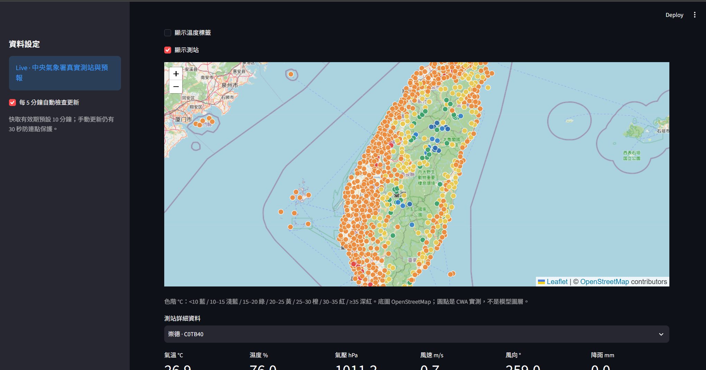
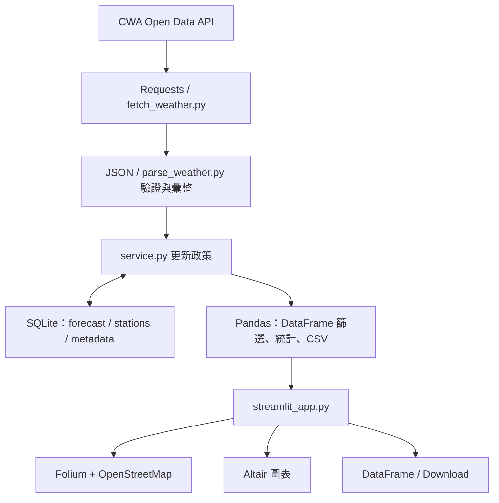

# HW1: CWA 天氣預報網站 using AI Agent

> 課程名稱：AIoT 與數據分析（AIoT & Data Analytics, AIoT-DA）  
> 作者：Aiden Xiao  
> 儲存庫：https://github.com/AidenXiao0924/HW-1-CWA-Weather-Forecast-Website  
> Live Demo：https://aiden-taiwan-weather.streamlit.app/

以 Streamlit 為唯一正式入口的台灣氣象 Dashboard。沿用原本的 Requests、JSON parser、資料驗證、SQLite schema 與 service 快取，替換 Presentation Layer。

## 網站畫面



## 資料流程與架構



Pandas 放在 SQLite 查詢結果與顯示之間；原 parser 與寫入驗證保持既有實作，不為了排列技術名詞重写資料管線。Streamlit 直接呼叫 service.load，沒有呼叫本機 REST API。

## 功能與技術

- Python 3.11+、Requests 取得 CWA JSON；python-dotenv 讀取本機設定。
- 即時觀測：縣市、測站／鄉鎮搜尋、溫度門檻、數量與均溫、完整資料表。
- Folium + streamlit-folium：台灣 OpenStreetMap 地圖、溫度分色圓點、popup、溫度標籤與測站顯示開關。
- 測站下拉選單顯示氣溫、濕度、氣壓、風速、風向、降雨量與觀測時間；缺值顯示「—」。地圖 popup 與明細選单獨立，避免點圖造成不必要的全頁重跑。
- 六區七日預報：Pandas 篩選，Altair 雙線圖、日期／溫度 Tooltip、摘要、資料表、UTF-8 BOM CSV 下載。CSV 僅包含目前選取區域。
- 原生 Streamlit tabs、sidebar、metrics、表格、選單與狀態提示，無自訂 JavaScript UI。
- SQLite 使用既有 parameterized SQL、唯一鍵與 mint <= maxt 約束；所有寫入仍透過 database.py。
- Windy 不再是正式依賴，不讀取或公開 Windy key。舊模型圖層程式僅保留於 legacy，與 CWA 測站實測不同。

## 安裝與本機啟動

```powershell
python -m venv .venv
.\.venv\Scripts\python.exe -m pip install -r requirements.txt
Copy-Item .env.example .env
.\.venv\Scripts\python.exe -m streamlit run streamlit_app.py
```

預設 http://localhost:8501 。Windows 可使用 setup.bat 安裝、start.bat 啟動、stop.bat 停止。launcher 只啟動 Streamlit；停止時驗證本專案程序。測試預覽若 8501 已被占用可加 `--server.port 8502`。

requirements.txt 是跨平台正式依賴；requirements-dev.txt 加入 pytest。requirements-lock.txt 是本次已安裝 Windows 環境的必要依賴閉包快照（含 Streamlit 自身間接依賴），不是所有平台的通用 lock。沒有 FastAPI、HTTPX 的直接依賴；Streamlit 自身若依賴 Uvicorn，不代表專案仍使用原 FastAPI 入口。

## 設定與 Demo / Live

```env
DATA_MODE=demo
CWA_API_KEY=
CWA_FORECAST_DATASET=F-D0047-091
CWA_OBSERVATION_DATASET=O-A0001-001
CACHE_TTL_SECONDS=600
```

Live 模式改為 DATA_MODE=live 並填入自己的 CWA_API_KEY。不要提交 .env 或 .streamlit/secrets.toml。環境變數優先於 .env；Community Cloud 使用 Secrets 根層的同名設定，程式會在載入 config 之前讀入。修改模式或金鑰後重新啟動程序，勿在同一程序的不同 session 使用不同 mode。

Demo 固定於 2026-09-23 的教學資料，使用 demo.db；Live 使用 data.db，失敗不會偷偷切換示範資料。可設定 WEATHER_CACHE_DIR 到可寫入／持久磁碟目錄。

## 三層快取與更新

1. SQLite 存最後成功資料及取得時間，正常重啟可繼續讀取。Live / Demo 分庫。
2. service 使用每類資料的執行緒 Lock、預設 600 秒 TTL、30 秒嘗試間隔及 force refresh。保留 last-known-good；錯誤顯示 stale，無資料則 unavailable。觀測時間超過兩小時也標示 stale，即使下載成功。
3. 不使用 st.cache_data 或 st.cache_resource 快取資料，避免遮蔽 service 的更新與錯誤狀態。Streamlit session 僅保存 widget 狀態；fragment 在活躍 session 每 300 秒檢查，沒有使用者連線時不常駐抓取。手動更新仍受 30 秒保護。

Lock 與嘗試間隔是單一 Python 程序共享；多程序部署不具跨程序節流。建議單一執行個體，SQLite 是目前快照快取，不是歷史資料倉儲。

## CWA 資料定義

本專案使用 `O-A0001-001` 自動氣象站觀測資料顯示測站位置、觀測時間與各項即時數據；使用 `F-D0047-091` 縣市天氣預報整理六個區域未來七天的最低與最高溫。

| 區域 | 縣市 |
|---|---|
| 北部 | 基隆、臺北、新北、桃園、新竹市、新竹縣 |
| 中部 | 苗栗、臺中、彰化、南投、雲林 |
| 南部 | 嘉義市、嘉義縣、臺南、高雄、屏東 |
| 東北部 | 宜蘭 |
| 東部 | 花蓮 |
| 東南部 | 臺東 |

離島測站可見於觀測，但不納入六區預報。每日最低／最高取區內各縣市各時段極值；18:00 夜間時段歸起始日，首個不完整日略過。資料不足時顯示實際天數。

## 測試

```powershell
.\.venv\Scripts\python.exe -m pip install -r requirements-dev.txt
.\.venv\Scripts\python.exe -m pytest test_weather.py test_dashboard.py -q
```

保留 parser、SQLite、cache、demo/live、錯誤處理測試；移除已退役 endpoint 測試。新增 DataFrame、文字／溫度篩選、CSV、Folium、Altair、併發防連點、觀測過期、Streamlit AppTest。測試使用隔離 SQLite，不覆寫真實資料庫。最新結果見 VALIDATION.md。

## 部署

正式網站部署於 Streamlit Community Cloud，連結本儲存庫 `main` 分支，入口為 `streamlit_app.py`。雲端 Secrets 設定如下：

```toml
DATA_MODE = "live"
CWA_API_KEY = "填入自己的金鑰"
```

GitHub `main` 更新後，Community Cloud 會自動更新網站。參考 [Community Cloud 部署](https://docs.streamlit.io/deploy/streamlit-community-cloud/deploy-your-app) 與 [Secrets 管理](https://docs.streamlit.io/deploy/streamlit-community-cloud/deploy-your-app/secrets-management)。雲端本機磁碟不可視為永久保存；重建／休眠後可能需重新取得 CWA。需要持久 cache 可選支援持久磁碟的主機並設 WEATHER_CACHE_DIR。

## 目錄

```text
streamlit_app.py      唯一正式網頁入口
 dashboard.py        Pandas / Folium / Altair helpers
 config.py           模式、金鑰、SQLite 目錄
 fetch_weather.py    Requests → JSON
 parse_weather.py    原有驗證與六區彙整
 database.py         原有 SQLite constraints / parameterized SQL
 service.py          快取、節流、錯誤政策
 demo_data.py        固定示範資料
 test_weather.py     資料層測試
 test_dashboard.py   UI/helper/integration 測試
 launcher.py         Windows 啟動與停止
 requirements*.txt   依賴
 legacy/             舊 FastAPI / frontend / Vercel 文件（歷史參考）
 MIGRATION.md        遷移摘要與 Git 狀態
 VALIDATION.md       本次驗證證據
```

## 已知限制

地圖底圖與 Folium 前端資源需要網路；失敗時仍可用原生表格與測站明細。沒有 Windy 模型動畫、歷史回放、Redis 或 Postgres。舊 API 不再支援；外部 API 消費者需另行設計，不另留第二套正式 UI。初次 live 抓取會等待 CWA timeout；沒有 cache 時如實顯示 unavailable。
